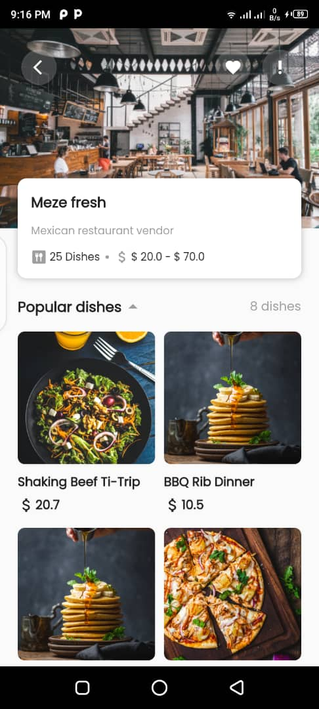
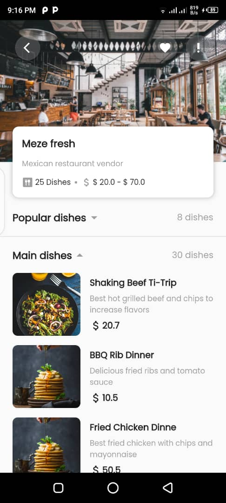

# Food Book Mobile

Food Book(Foode) is a mobile app that would allow vendors at the cafeteria to add the day's menu at the beginning of each day. Students and staff would then plan to buy meals on campus or find another alternative. 

Aside from viewing the menu, students and staff can order and pay for meals before to ensure that they won't miss meals. Every vendor would have an account on the app, and they would be able to create, update and delete a meal from their servings. They would also be able to specify a menu item that is out of stock to notify the students and staff before placing their orders. This would create a more efficient way of ordering and getting food at the school’s cafeteria and ensuring customers’(students and staff) satisfaction.


## Features

- Sign in / Login
- View meals / restaurant
- Order / book food
- Create food plan (vendors)
- Make payments
- Rate restaurants and meals

## Installation

**Step 1**

Download or clone this repo by using the link below:

```bash
https://github.com/Gabin-ishimwe/food-app-mobile.git
```

**Step 2**

Go to project root and execute the following command in console to get the required dependencies:

```bash
flutter pub get 
```
**Step 3**

Still in the project root and execute the following command in console to get run the application:

```bash
flutter run 
```
      
## Tech Stack

**UI**: Dart & Flutter

**Server:** Firebase

## Screens
<p float="left">
  
   
  
  
  
  
  
  
  
  
  
  
  
</p>

## Authors

- [Gabin Ishimwe](https://github.com/Gabin-ishimwe)
